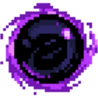
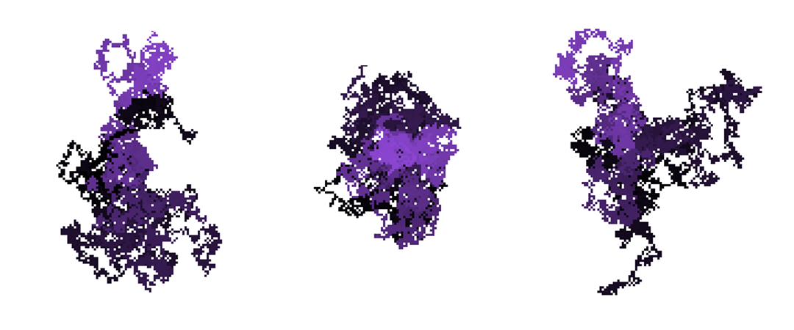
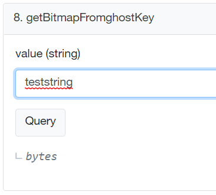
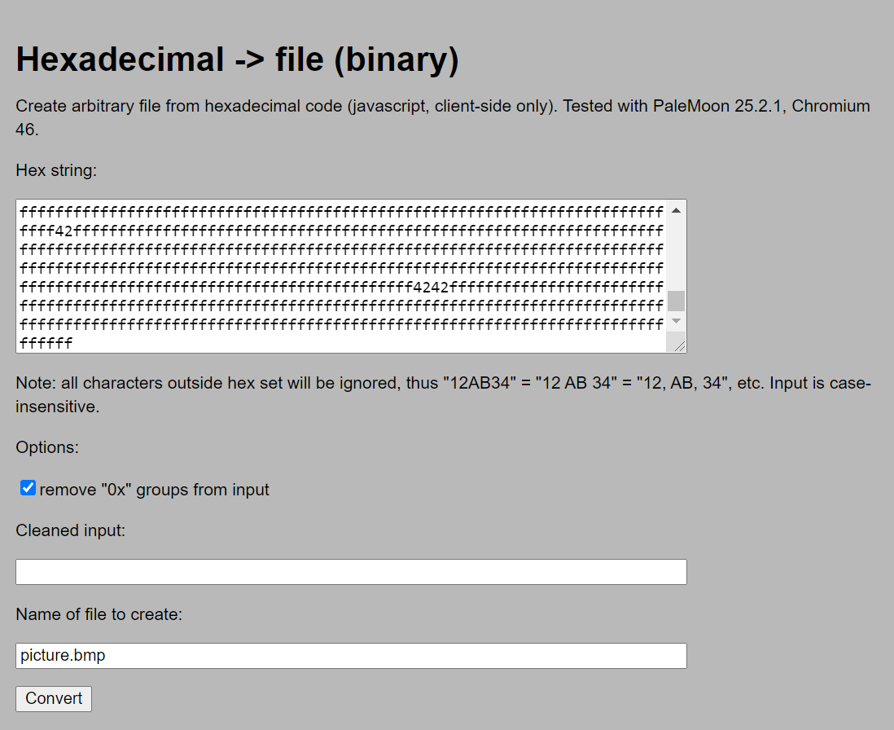
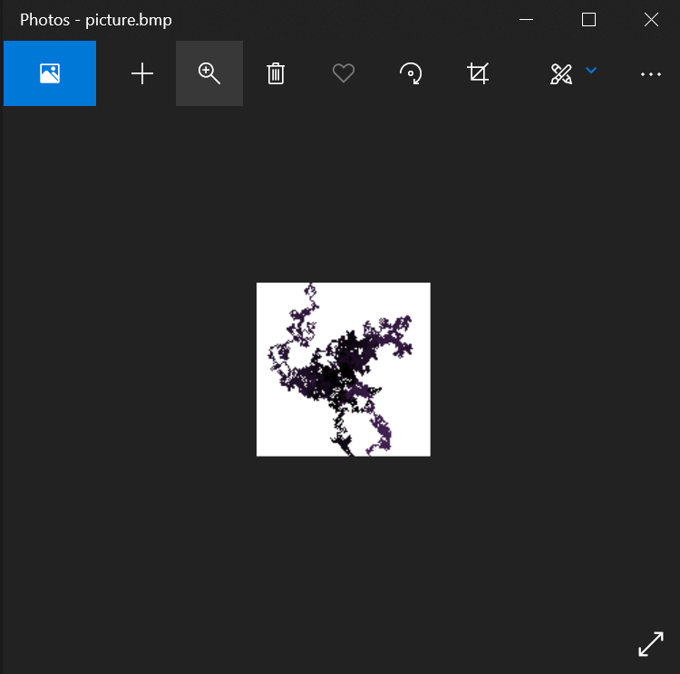

# [cryptoghost.art](https://cryptoghost.art "cryptoghost")

## Cryptoghost is the only NFT that doesn't rely on external hosting for pictures assets, everything is on the Ethereum blockchain, while Ethereum exist, picture exist.

Non Fungible Token is a growing phenomenon appeared in 2017, It allows people to "own" some image by writing an entry in a [Ethereum smart contract](https://ethereum.org/en/developers/docs/smart-contracts/). Once your personal ethereum address written in the registry, it is the proof that some token ID is affected to your adress, then by calling some methods in the smart contract, you can trade and transfert your NFT to other ethereum addresses.

## Owning a token ID and what else ? 

NFTs are often criticized because image sources aren't stored on the blockchain, this is simply because writing data in a smart contract is so expensive that storing an image would cost thousands of dollars of gas fees per image.

Pictures assets must be hosted elsewhere, generally on IPFS or private networks, the art lifespan depends on the lifespan of the ethereum blockchain and the external hosting, if one may disappear, the art disappears. 

## The particular case of on-chain generated NFTs 
Storing pictures on blockchain is not possible, but what about generating files on-demand ? 

Cryptoghost represent cryptographics fractals generated from a chosen string



In this case, no need to store the picture somewhere but just the input string in the contract. 

Then with solidity the image file can be generated on the fly.

```java
function getBitmapFromGhostKey(string memory value)
    public
    view
    returns (bytes memory)
{
    // The header of the bitmap file, with color palette
    bytes memory headers =
hex"424d384400000000000036040000280000008000000080000000010008000000000002400000120b0000120b0000000000000000000000000000000000000100010002010200030103000401030005020400060205000703060008030600090307000a0408000b0409000c0409000d050a000e050b000f060c0010060c0011060d0012070e0013070f0013070f001408100015081100160912001709130018091300190a14001a0a15001b0b16001c0b16001d0b17001e0c18001f0c1900200c1900210d1a00220d1b00230e1c00240e1c00250e1d00260f1e00260f1f00270f1f0028102000291021002a1122002b1122002c1123002d1224002e1225002f132600301326003113270032142800331429003414290035152a0036152b0037162c0038162c0039162d0039172e003a172f003b172f003c1830003d1831003e1932003f19320040193300411a3400421a3500431a3500441b3600451b3700461c3800471c3900481c3900491d3a004a1d3b004b1e3c004c1e3c004c1e3d004d1f3e004e1f3f004f1f3f00502040005120410052214200532142005421430055224400562245005722450058234600592347005a2448005b2448005c2449005d254a005e254b005f264c005f264c0060264d0061274e0062274f0063274f006428500065285100662952006729520068295300692a54006a2a55006b2a55006c2b56006d2b57006e2c58006f2c5800702c5900712d5a00722d5b00722d5b00732e5c00742e5d00752f5e00762f5f00772f5f0078306000793061007a3162007b3162007c3163007d3264007e3265007f326500803366008133670082346800833468008434690085356a0085356b0086356b0087366c0088366d0089376e008a376e008b376f008c3870008d3871008e3972008f39720090397300913a7400923a7500933a7500943b7600953b7700963c7800973c7800983c7900983d7a00993d7b009a3d7b009b3e7c009c3e7d009d3f7e009e3f7e009f3f7f00a0408000a1408100a2408100a3418200a4418300a5428400a6428500a7428500a8438600a9438700aa448800ab448800ab448900ac458a00ad458b00ae458b00af468c00b0468d00b1478e00b2478e00b3478f00b4489000b5489100b6489100b7499200b8499300b94a9400ba4a9400bb4a9500bc4b9600bd4b9700be4c9800be4c9800bf4c9900c04d9a00c14d9b00c24d9b00c34e9c00c44e9d00c54f9e00c64f9e00c74f9f00c850a000c950a100ca50a100cb51a200cc51a300cd52a400ce52a400cf52a500d053a600d153a700d153a700d254a800d354a900d455aa00d555ab00d655ab00d756ac00d856ad00d957ae00da57ae00db57af00dc58b000dd58b100de58b100df59b200e059b300e15ab400e25ab400e35ab500e45bb600e45bb700e55bb700e65cb800e75cb900e85dba00e95dba00ea5dbb00eb5ebc00ec5ebd00ed5fbe00ee5fbe00ef5fbf00f060c000f160c100ffffff00";
    bytes memory pixels = new bytes(16384);

    int256 x = 64;
    int256 y = 64;

    int256 totalIndex = 0;
    int256 colorIndex = 0;
    string memory tmp = value;
    bytes memory cha;

    // Fill the bitmap with blank
    for (uint256 iFill = 0; iFill < 16384; iFill++) {
        pixels[iFill] = bytes1(uint8(255));
    }

    // The algorithm to assign pixels value
    for (uint256 i = 0; i < 151; i++) {
        tmp = BytesUtils.sha256HexString(tmp);
        cha = bytes(tmp);
        for (uint256 iChar = 0; iChar < 64; iChar++) {
            if (uint8(cha[iChar]) == 48 || uint8(cha[iChar]) == 49) {
                x += 1;
            } else if (uint8(cha[iChar]) == 50 || uint8(cha[iChar]) == 51) {
                x += -1;
            } else if (uint8(cha[iChar]) == 52 || uint8(cha[iChar]) == 53) {
                y += 1;
            } else if (uint8(cha[iChar]) == 54 || uint8(cha[iChar]) == 55) {
                y += -1;
            } else if (uint8(cha[iChar]) == 56 || uint8(cha[iChar]) == 57) {
                x += 1;
                y += 1;
            } else if (uint8(cha[iChar]) == 97 || uint8(cha[iChar]) == 98) {
                x += -1;
                y += 1;
            } else if (
                uint8(cha[iChar]) == 99 || uint8(cha[iChar]) == 100
            ) {
                x += 1;
                y += -1;
            } else if (
                uint8(cha[iChar]) == 101 || uint8(cha[iChar]) == 102
            ) {
                x += -1;
                y += -1;
            }
            if (y >= 128 || y < 0 || x >= 128 || x < 0) {
                y = 64;
                x = 64;
                totalIndex = 0;
            }

            pixels[uint256(x) + (128 * uint256(127 - y))] = bytes1(
                uint8(totalIndex / 38)
            );
            totalIndex += 1;
        }
    }
    return BytesUtils.MergeBytes(headers, pixels);
}
```

## Quickly test it without coding
Go the the [Etherscan page of the contract](https://etherscan.io/address/0x6f6dba0170dE97249083994d85204F507Cf416B4#readContract "Etherscan page of the contract") then call the `getBitmapFromghostKey` function with some string input



The result is some hex-encoded result of a .bmp file, you can quickly generate the file with [this website](https://tomeko.net/online_tools/hex_to_file.php?lang=en "tomeko.net")



## This is the output bitmap file generated from a smart contract




